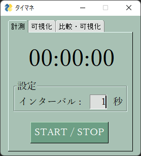
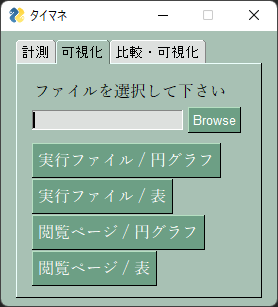

# タイマネ

## 概要

パソコン上で実施した作業と時間を記録・可視化するデスクトップアプリケーション

## ツールのダウンロード

使用するには [こちら](https://github.com/masachika-kamada/time-manage/releases/tag/v1.0.0) のリリースページから実行ファイル (timane.exe) をダウンロードしてください

## 使い方

### 計測

1. tiname.exe を起動すると、以下の画面が表示されます

2. START / STOP ボタンを押すことで、タイマーが動き出し、作業の記録を開始します

3. 再度 START / STOP ボタンを押すと、タイマーが停止し、作業の記録を終了します

4. timane_csvdata フォルダに、日付ごとの CSV ファイルが作成されます

### 可視化

1. timane.exeを起動し、「可視化」のタブを選択すると、以下の画面が表示されます

2. Browse ボタンを押して、可視化する CSV ファイルを選択します (timane_csvdata フォルダ内の CSV ファイルを選択してください)

3. 可視化するデータとその形式をボタンで選択すると、CSV ファイルに保存した作業の記録を可視化できます
